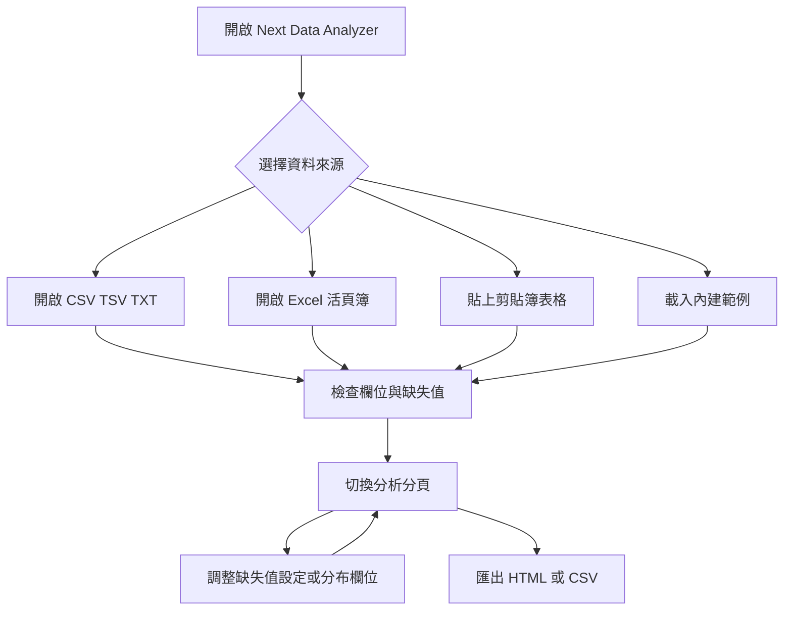
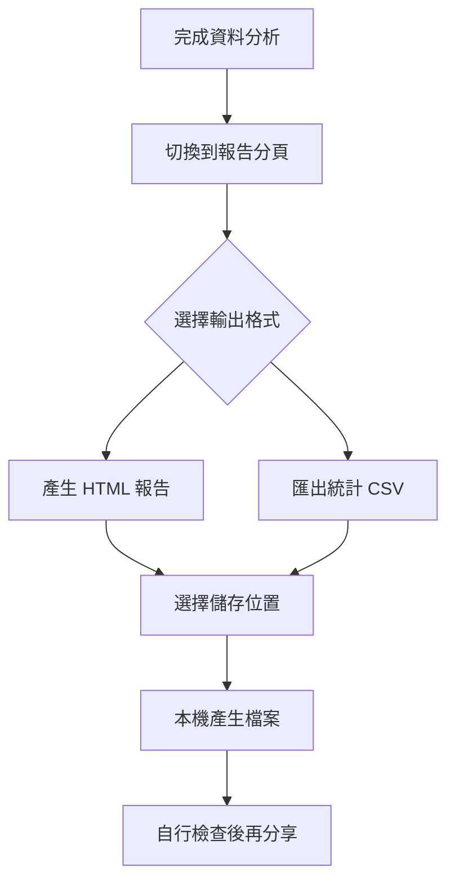

# Next Data Analyzer 使用者操作手冊

Next Data Analyzer 是一套在本機執行的資料分析工具，可讀取 CSV、TSV、TXT、Excel 活頁簿與剪貼簿表格文字，快速檢視欄位型別、缺失值、分布圖、相關矩陣，並匯出 HTML 視覺化報告或欄位統計 CSV。

## 目錄

- [快速開始](#快速開始)
- [整體使用流程](#整體使用流程)
- [介面區域](#介面區域)
- [匯入資料](#匯入資料)
- [分析分頁](#分析分頁)
- [缺失值設定](#缺失值設定)
- [匯出結果](#匯出結果)
- [建置桌面版](#建置桌面版)
- [離線隱私與資料安全](#離線隱私與資料安全)
- [限制與疑難排解](#限制與疑難排解)
- [維護者驗證](#維護者驗證)

## 快速開始

### 使用已建置的桌面版

若專案已完成桌面建置，可直接執行：

```text
src-tauri\target\release\next-data-analyzer.exe
```

若要安裝成 Windows 應用程式，執行安裝檔：

```text
src-tauri\target\release\bundle\nsis\Next Data Analyzer_0.1.0_x64-setup.exe
```

桌面版支援開啟本機檔案、讀取剪貼簿、切換 Excel 工作表、匯出 HTML 報告與 CSV 統計檔。

### 從原始碼啟動網頁試用版

在專案根目錄開啟 PowerShell，首次使用先安裝依賴：

```powershell
npm install
```

啟動網頁試用版：

```powershell
npm run dev
```

開啟 <http://localhost:1420>，點選「範例：銷售資料（UTF-8）」或「範例：員工資料（Big5）」開始試用。

網頁試用版主要用於檢視內建範例與分析介面。開啟本機檔案、剪貼簿貼上、HTML / CSV 儲存需使用桌面版。

### 從原始碼啟動桌面開發版

Windows 開發環境需具備 Node.js、npm、Rust / Cargo、Microsoft C++ 建置工具與 WebView2 執行環境。

```powershell
npm run tauri dev
```

這個指令會啟動前端服務、編譯 Tauri，並開啟桌面視窗。若 `npm run dev` 已在使用 1420 連接埠，請先停止該終端機。

## 整體使用流程



## 介面區域

| 區域 | 用途 |
| --- | --- |
| 頂端工具列 | 顯示資料名稱、列數、欄數與編碼；提供開檔、剪貼簿貼上、缺失值設定與重新解碼。 |
| 分頁列 | 切換「總覽」、「缺失值」、「分布」、「相關性」、「報告」。 |
| 主內容區 | 顯示統計卡片、表格、圖表與匯出按鈕。窄視窗下寬表格會在區塊內水平捲動。 |
| 訊息提示 | 載入、儲存、錯誤會以底部提示顯示。 |

## 匯入資料

| 來源 | 操作 |
| --- | --- |
| CSV、TSV、TXT | 在桌面版點選「開啟檔案」。TXT 必須是有分隔符號的表格文字。 |
| XLSX、XLS | 在桌面版點選「開啟檔案」。若活頁簿有多張工作表，可在頂端選單切換。 |
| 剪貼簿文字 | 從 Excel 或其他表格工具複製含欄名的範圍，再點選「剪貼簿貼上」。 |
| 內建範例 | 在首頁點選 UTF-8 或 Big5 範例，不需要準備檔案。 |

匯入時，第一個有效資料列會作為欄名。空白列會被清理，空白欄名會自動補成未命名欄位。一次分析一份資料或一張工作表；載入新資料會取代目前資料。

文字檔會自動偵測 UTF-8、UTF-8 BOM、UTF-16LE 與 Big5。中文顯示不正確時，使用頂端「重新解碼…」選擇 UTF-8 或 Big5。Excel 與剪貼簿內容不使用重新解碼功能。

## 分析分頁

| 分頁 | 內容 |
| --- | --- |
| 總覽 | 資料列數、欄位數、缺失儲存格、完整資料列、欄位概況與資料預覽。 |
| 缺失值 | 各欄缺失率、缺失模式熱力圖與常見缺失組合。列數較多時熱力圖可能抽樣。 |
| 分布 | 依欄位檢視數值直方圖、類別次數或日期分布；數值欄可調整分組數。 |
| 相關性 | 顯示數值欄位的 Pearson 與 Spearman 相關矩陣，並列出最強的相關組合。 |
| 報告 | 產生 HTML 視覺化報告或匯出欄位統計 CSV。 |

## 缺失值設定

點選「缺失值設定」後，可每行輸入一個缺失標記，也可以使用逗號分隔。儲存後，程式會用新的規則重新分析目前資料。

預設會將空白值與下列文字視為缺失值：

```text
NA, N/A, NULL, NaN, None, missing, unknown, -, ?, 未知, 缺, 缺失, 無
```

判斷會去除前後空白且不分大小寫。若這些文字在你的資料中是有效值，請從設定中移除後重新分析。


## 匯出結果

桌面版載入資料後，切換到「報告」分頁：

1. 點選「產生 HTML 報告」，選擇儲存位置。預設檔名為 `analysis-report.html`。
2. 或點選「匯出統計 CSV」，選擇儲存位置。預設檔名為 `column-stats.csv`。
3. 等待底部提示顯示已儲存。

HTML 報告會包含資料摘要、欄位表、缺失圖、最多 24 個符合條件欄位的分布圖，以及可計算時的 Pearson 相關矩陣。圖表會以圖片內嵌，不需要外部圖表服務。

CSV 統計檔使用 UTF-8 BOM，方便 Excel 開啟。它是欄位統計摘要，不是原始資料匯出。匯出時請避免覆寫來源檔案。



## 建置桌面版

若你只想重新產生 Windows 桌面執行檔與安裝檔，雙擊根目錄的：

```text
build-desktop.bat
```

批次檔會自動切到專案根目錄並執行：

```powershell
npm run tauri build
```

建置成功後會產生：

```text
src-tauri\target\release\next-data-analyzer.exe
src-tauri\target\release\bundle\nsis\Next Data Analyzer_0.1.0_x64-setup.exe
```

若要手動建置，也可在 PowerShell 執行：

```powershell
npm run tauri build
```

## 離線隱私與資料安全

- 分析、開檔、剪貼簿讀取與匯出都在本機執行，沒有資料上傳流程。
- 安裝依賴與首次編譯可能需要網路；已建置的桌面程式可離線使用。
- 資料與缺失值設定只保存在當次工作階段記憶體中；關閉視窗或重新整理後需重新載入資料。
- HTML 報告與 CSV 統計檔可能包含來源路徑、資料名稱、欄名、統計值與類別內容。分享前請先檢查輸出檔。

## 限制與疑難排解

| 情況 | 處理方式 |
| --- | --- |
| 檔案超過 512MB | 本機檔案上限為 512 MiB，請先拆分資料或另存為較小 CSV。 |
| 中文亂碼 | 文字檔使用「重新解碼…」切換 UTF-8 或 Big5；若仍不正確，先將來源另存為 UTF-8 CSV。 |
| 找不到 Excel 工作表選單 | 只有多張工作表才會顯示選單。請確認載入的是 XLSX / XLS。 |
| 工作表內容為空 | 選擇包含欄名與資料列的工作表；完全空白工作表無法分析。 |
| 剪貼簿沒有內容 | 重新複製含欄名的表格範圍，再於桌面版點選「剪貼簿貼上」。 |
| 瀏覽器無法開檔或匯出 | 改用桌面版 `.exe`、安裝版，或 `npm run tauri dev`。 |
| 無法讀取或儲存檔案 | 確認路徑存在、帳號有權限，且目的資料夾可寫入。 |
| 1420 連接埠已使用 | 停止已開啟的 `npm run dev` 或其他占用程式後重試。 |
| 桌面建置失敗 | 檢查 Node.js、npm、Rust / Cargo、Microsoft C++ 建置工具與 WebView2 是否已安裝。 |

## 維護者驗證

以下指令供維護者在修改程式後驗證，不是一般使用者啟動應用程式的必要步驟。

```powershell
npm run check
npm test
npm run build
npm run test:e2e
cargo test --manifest-path src-tauri/Cargo.toml
cargo check --manifest-path src-tauri/Cargo.toml
```

發版前仍應在桌面版人工驗收：開啟本機檔案、剪貼簿貼上、Excel 工作表切換、HTML 報告匯出與 CSV 統計匯出，並開啟輸出檔確認內容。
